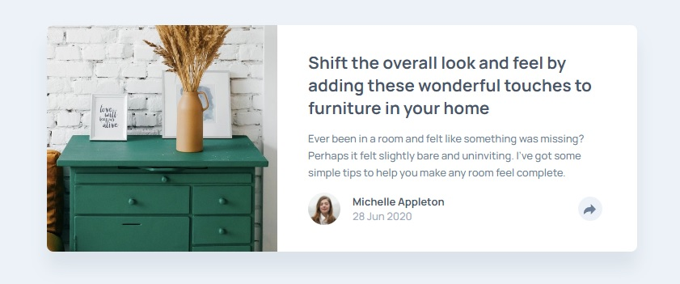

# Frontend Mentor - Article preview component solution

This is a solution to the [Article preview component challenge on Frontend Mentor](https://www.frontendmentor.io/challenges/article-preview-component-dYBN_pYFT). Frontend Mentor challenges help you improve your coding skills by building realistic projects.

## Table of contents

- [Overview](#overview)
  - [The challenge](#the-challenge)
  - [Screenshot](#screenshot)
  - [Links](#links)
- [My process](#my-process)
  - [Built with](#built-with)
  - [What I learned](#what-i-learned)
  - [Continued development](#continued-development)
- [Author](#author)

## Overview

### The challenge

Users should be able to:

- View the optimal layout for the component depending on their device's screen size
- See the social media share links when they click the share icon

### Screenshot

### Links

- Solution URL: [https://github.com/wavegate/article-preview-component-master](https://github.com/wavegate/article-preview-component-master)
- Live Site URL: [https://earnest-marshmallow-8d5a30.netlify.app/](https://earnest-marshmallow-8d5a30.netlify.app/)

## My process

### Built with

- Semantic HTML5 markup
- CSS custom properties
- Flexbox
- JavaScript

### What I learned

- Creating tooltips and the arrows that go along with the tooltip.
- Show element on click and hide element when clicking off from it (only partially figured out).
- Changing SVG to white with `filter: brightness(0) invert(1)`
- Media queries with Javascript

### Continued development

I'm starting to recognize how messy CSS can become with different media queries and a lot of moving parts to have to manage, especially with media queries in the JavaScript as well. I may look to learn SASS/SCSS soon.

## Author

- Website - [wavegate](https://github.com/wavegate)
- Frontend Mentor - [@wavegate](https://www.frontendmentor.io/profile/wavegate)
